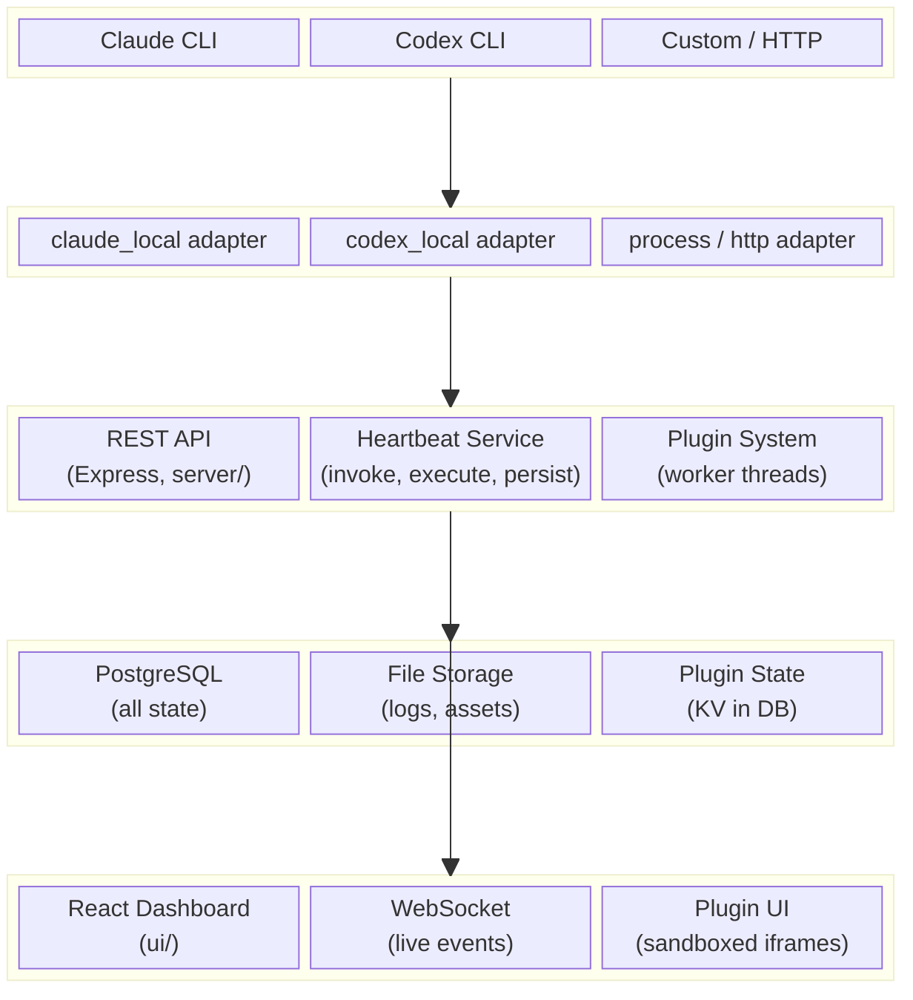
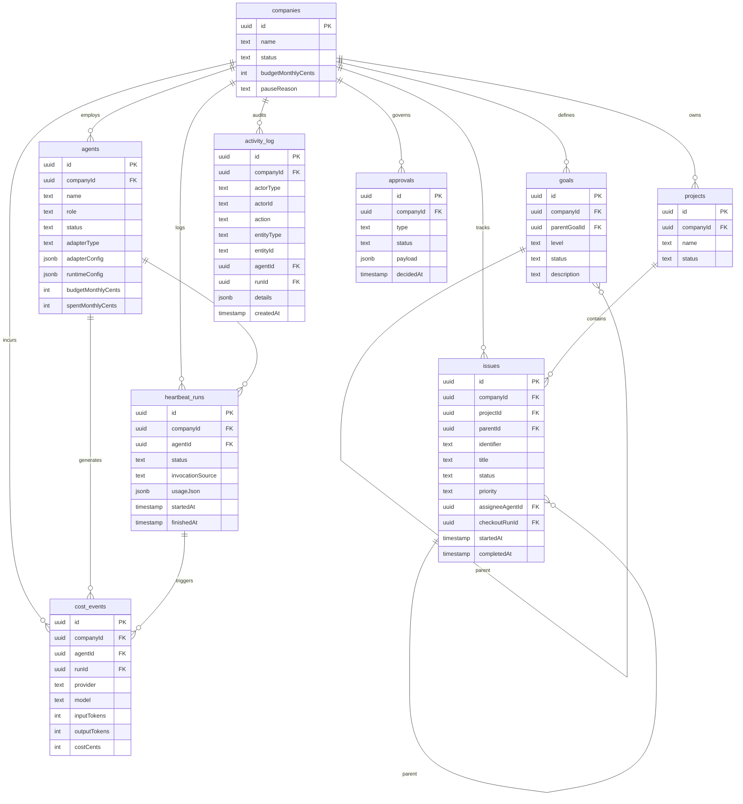
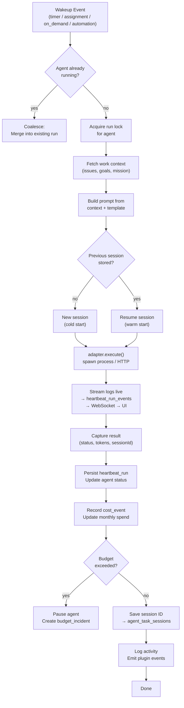
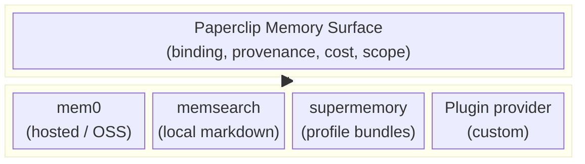
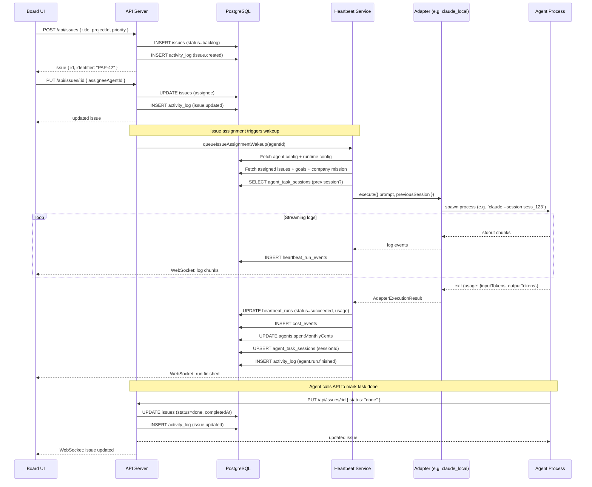
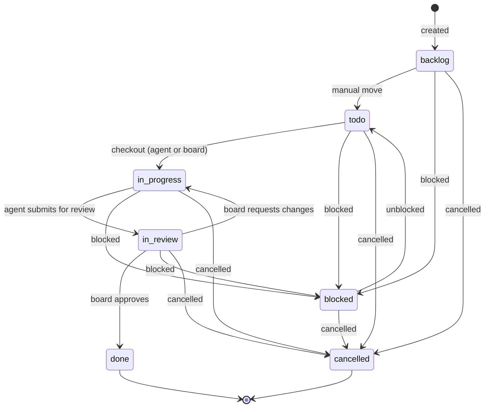
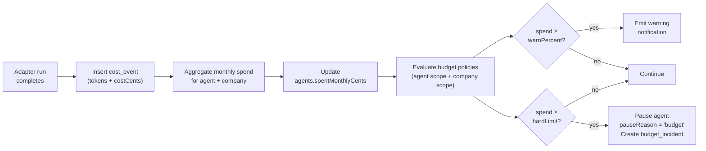
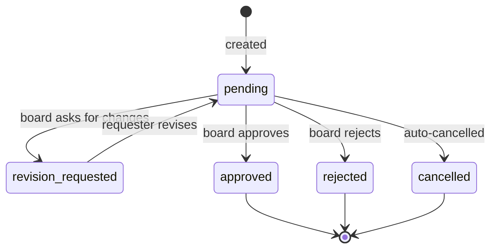
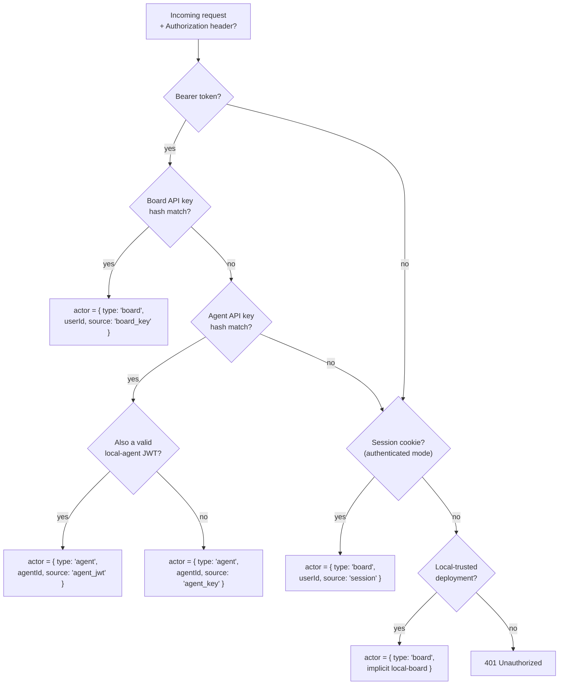

# Paperclip Architecture

**Date:** 2026-03-30  
**Audience:** Contributors, operators, and integrators who want to understand how Paperclip works internally.

---

## Table of Contents

1. [What is Paperclip?](#1-what-is-paperclip)
2. [System Layers](#2-system-layers)
3. [Server Architecture](#3-server-architecture)
4. [Database Schema](#4-database-schema)
5. [Agent Adapters](#5-agent-adapters)
6. [Agent Runtime (Heartbeats)](#6-agent-runtime-heartbeats)
7. [Memory System](#7-memory-system)
8. [Plugin System](#8-plugin-system)
9. [Task Checkout & Orchestration Flow](#9-task-checkout--orchestration-flow)
10. [Issue State Machine](#10-issue-state-machine)
11. [Budget Enforcement](#11-budget-enforcement)
12. [Approval Gates](#12-approval-gates)
13. [Authentication](#13-authentication)
14. [UI & Live Events](#14-ui--live-events)
15. [Deployment Modes](#15-deployment-modes)
16. [Key Architectural Patterns](#16-key-architectural-patterns)

---

## 1. What is Paperclip?

Paperclip is an **open-source orchestration control plane for autonomous AI companies**.
It coordinates teams of AI agents, tracking their work, enforcing budgets, and providing human oversight — without running the agents itself.

**Core philosophy:**

- Paperclip is the *nervous system* of an autonomous company, not an agent framework.
- Agents run *externally* and "phone home" to Paperclip via REST API.
- Every entity is scoped to a **company**, supporting multiple isolated companies in one deployment.
- Humans keep control through approvals, budget caps, and a full audit trail.

**Key problems solved:**

| Problem | Solution |
|---|---|
| Two agents grabbing the same task | Atomic checkout with DB-level row locking |
| Runaway token spend | Budget policies with hard-stop enforcement |
| Agent context lost between runs | Session resume persisted in DB |
| Tasks disconnected from goals | Every issue traces ancestry to company mission |
| Opacity (what did agents do?) | Full activity log for every mutation |
| Single agent framework lock-in | Pluggable adapter system |

---

## 2. System Layers



**Two hard boundaries:**

1. **Control Plane ↔ Agents**: Agents are external processes. Paperclip never starts them directly — adapters do. Agents communicate back via bearer-token API calls.
2. **Control Plane ↔ Plugins**: Plugins run in isolated Worker threads. They communicate with the host through a capability-gated bridge, not direct DB access.

---

## 3. Server Architecture

### 3.1 Express App Structure (`server/src/app.ts`)

```
Express App
├── Middleware Stack
│   ├── HTTP logging
│   ├── Private-hostname guard (authenticated mode)
│   ├── Actor resolution (auth middleware)
│   ├── Board mutation guard
│   └── JSON parser (10 MB limit — supports company import)
│
├── /api/auth/*        ← BetterAuth session handlers
├── /api/llm/*         ← OpenAI-compatible LLM proxy routing
│
├── API Router (all guarded by boardMutationGuard)
│   ├── /api/health
│   ├── /api/companies       companies.ts
│   ├── /api/agents          agents.ts
│   ├── /api/issues          issues.ts
│   ├── /api/projects        projects.ts
│   ├── /api/goals           goals.ts
│   ├── /api/approvals       approvals.ts
│   ├── /api/costs           costs.ts
│   ├── /api/activity        activity.ts
│   ├── /api/dashboard       dashboard.ts
│   ├── /api/routines        routines.ts
│   ├── /api/secrets         secrets.ts
│   ├── /api/plugins         plugins.ts
│   ├── /api/access          access.ts
│   └── /api/company-skills  company-skills.ts
│
├── Plugin System
│   ├── Plugin loader & lifecycle manager
│   ├── Job scheduler
│   ├── Event bus (domain events → plugins)
│   ├── Plugin UI static routes
│   └── Plugin webhooks
│
└── UI Serving
    ├── Static build (production)
    ├── Vite dev middleware with HMR (development)
    └── SPA fallback → index.html
```

### 3.2 Key Services (`server/src/services/`)

| Service file | Responsibility |
|---|---|
| `heartbeat.ts` | Invoke agents, execute adapter, persist results, stream logs |
| `issues.ts` | Task CRUD, atomic checkout, hierarchy, comments |
| `agents.ts` | Agent CRUD, permissions, adapter management |
| `companies.ts` | Company CRUD, export/import, portability |
| `costs.ts` | Cost events, spend aggregation |
| `budgets.ts` | Budget policy evaluation, hard-stop enforcement |
| `approvals.ts` | Approval requests and decisions |
| `activity-log.ts` | Immutable audit trail for every mutation |
| `goals.ts` | Goal hierarchy and alignment context |
| `projects.ts` | Projects and workspace management |
| `execution-workspaces.ts` | Execution environment management |
| `workspace-runtime.ts` | Runtime services (Docker, etc.) |
| `secrets.ts` | Secret management and encryption |
| `plugin-lifecycle.ts` | Plugin install / enable / disable / uninstall |
| `plugin-event-bus.ts` | Domain event → plugin handler dispatch |
| `plugin-job-scheduler.ts` | Plugin-defined cron-style jobs |
| `live-events.ts` | WebSocket broadcast to browser |

### 3.3 Middleware (`server/src/middleware/`)

```
Request
  │
  ▼
┌──────────────────────────────────┐
│ auth.ts                          │
│  1. Bearer token → Agent key?    │
│  2. Bearer token → Board key?    │
│  3. Session cookie (auth mode)?  │
│  4. Local-trusted implicit board │
│  Sets: req.actor                 │
└──────────────┬───────────────────┘
               │
               ▼
┌──────────────────────────────────┐
│ authz.ts                         │
│  Company membership check        │
│  Agent company isolation         │
│  Role-based permission check     │
└──────────────┬───────────────────┘
               │
               ▼
         Route handler
```

---

## 4. Database Schema

Paperclip uses a single PostgreSQL database managed with **Drizzle ORM** (`packages/db/`).

### 4.1 Core Domain Entities



### 4.2 Agent State Tables

| Table | Purpose |
|---|---|
| `agent_api_keys` | Hashed API keys for agent authentication |
| `agent_wakeup_requests` | Pending wakeup queue (timer, assignment, on_demand, automation) |
| `agent_task_sessions` | Per-task session IDs for adapter resume |
| `agent_runtime_state` | General session state blob persisted across runs |
| `agent_config_revisions` | History of agent config changes |
| `heartbeat_run_events` | Log event stream per run (streamed live to UI) |

### 4.3 Budget & Finance Tables

| Table | Purpose |
|---|---|
| `budget_policies` | Rules: scope + metric + limit + window |
| `budget_incidents` | Records of policy violations |
| `finance_events` | Revenue/expense entries (non-token costs) |
| `cost_events` | Token-use billing events from adapter runs |

### 4.4 Plugin Tables

| Table | Purpose |
|---|---|
| `plugins` | Installed plugins (manifest, status) |
| `plugin_config` | Plugin configuration values |
| `plugin_company_settings` | Per-company plugin overrides |
| `plugin_state` | Plugin KV state store |
| `plugin_entities` | Plugin-managed external entities |
| `plugin_jobs` | Scheduled job definitions and history |
| `plugin_webhooks` | Inbound webhook registrations |
| `plugin_logs` | Plugin runtime log storage |

---

## 5. Agent Adapters

Adapters are **pluggable executor interfaces** in `packages/adapters/`. They define how to launch and communicate with a specific kind of agent. Paperclip never runs agents directly — adapters do.

### 5.1 Available Adapters

| Adapter | Package | How it works |
|---|---|---|
| `claude_local` | `packages/adapters/claude-local` | Spawns `claude` CLI, streams stdout |
| `codex_local` | `packages/adapters/codex-local` | Spawns `codex` CLI, streams stdout |
| `opencode_local` | `packages/adapters/opencode-local` | Spawns `opencode` CLI |
| `cursor` | `packages/adapters/cursor-local` | Spawns Cursor in headless background mode |
| `pi_local` | `packages/adapters/pi-local` | Spawns embedded Pi agent locally |
| `gemini_local` | `packages/adapters/gemini-local` | Spawns Gemini CLI, supports session resume |
| `hermes_local` | (built-in) | Runs Hermes agent locally |
| `openclaw_gateway` | `packages/adapters/openclaw-gateway` | HTTP calls to OpenClaw gateway |
| `process` | (built-in) | Spawns arbitrary shell command |
| `http` | (built-in) | POSTs to external HTTP endpoint (fire-and-forget) |

### 5.2 Adapter Package Structure

```
packages/adapters/claude-local/
├── src/
│   ├── index.ts           # Manifest + config schema (exported)
│   ├── server/
│   │   ├── execute.ts     # Core execution logic
│   │   ├── test.ts        # Environment diagnostics
│   │   └── skills.ts      # Runtime skill injection (optional)
│   ├── cli/
│   │   ├── index.ts       # CLI runner wrapper
│   │   └── format-event.ts # Stdout/stderr parsing
│   ├── ui/
│   │   ├── index.tsx      # React config form (shown in board UI)
│   │   └── build-config.ts
│   └── shared/
│       └── stream.ts      # Event stream types
└── package.json
```

### 5.3 Adapter Contract

Every adapter exports:

```typescript
// Manifest (static metadata)
export interface AdapterManifest {
  id: string;
  name: string;
  description: string;
  configSchema: ZodSchema;         // Validated when saved
  runtimeConfigSchema: ZodSchema;  // Validated on every run
  defaultRuntimeConfig: object;
  capabilities?: {
    sessionResume?: boolean;   // Can resume previous session?
    skillInjection?: boolean;  // Supports runtime skill bundles?
    streamingLogs?: boolean;   // Streams stdout live?
  };
}

// Execution input
interface AdapterExecutionContext {
  config: AdapterConfig;
  runtimeConfig: AdapterRuntimeConfig;
  prompt: string;
  previousSession?: { id: string };  // Session resume
  env?: Record<string, string>;
}

// Execution result
interface AdapterExecutionResult {
  status: "succeeded" | "failed" | "timed_out" | "cancelled";
  usage?: { inputTokens: number; outputTokens: number };
  sessionId?: string;   // Stored for next run
  logs: string;
  exitCode?: number;
}
```

---

## 6. Agent Runtime (Heartbeats)

Agents do **not** run continuously. They run in **heartbeats**: bounded execution windows triggered by events.

### 6.1 Heartbeat Lifecycle



### 6.2 Wakeup Sources

| Source | Trigger | Config |
|---|---|---|
| `timer` | Scheduled interval | `runtimeConfig.intervalSec` (0 = disabled) |
| `assignment` | Issue checked out to this agent | `runtimeConfig.wakeOnAssignment` |
| `on_demand` | Manual button / API call | `runtimeConfig.wakeOnOnDemand` |
| `automation` | System automation / routine | `runtimeConfig.wakeOnAutomation` |

### 6.3 Session Resume

Sessioned adapters (e.g. `claude_local`, `codex_local`) persist conversation state across heartbeats:

```
Run N:   adapter.execute({ previousSession: null })
           → Creates session "sess_abc"
           → Stored: agent_task_sessions { agentId, issueId, sessionId: "sess_abc" }

Run N+1: adapter.execute({ previousSession: { id: "sess_abc" } })
           → Claude CLI resumes from "sess_abc"
           → Context retained without re-sending full history
```

This gives agents **continuity across heartbeats** without exploding prompt size.

### 6.4 Coalescing

If multiple wakeup events arrive while an agent is already running, they are merged:

```typescript
const lock = runLocksByAgent.get(agentId);
if (lock) {
  return lock;  // Wait for current run — no duplicate spawn
}
const runLock = executeAndPersist().finally(() => {
  runLocksByAgent.delete(agentId);
});
runLocksByAgent.set(agentId, runLock);
```

---

## 7. Memory System

Paperclip does **not** implement a proprietary memory engine. Instead, it defines a **control-plane memory surface** that can sit above different memory providers.

### 7.1 Design Goals

- Stay company-scoped (memory is isolated per company)
- Let each company choose a default memory provider
- Let individual agents override that default
- Keep provenance back to Paperclip runs, issues, comments, and documents
- Record memory-related cost the same way token cost is recorded
- Work with plugin-provided memory providers, not only built-ins

### 7.2 Two-Layer Model



**Layer 1 — Control plane binding:**
Decides which provider is active for a company or agent, logs every memory operation (source run/issue/comment), tracks cost/latency.

**Layer 2 — Provider adapter:**
Converts Paperclip memory requests to provider-specific calls. The provider owns extraction heuristics, embedding, ranking, and profile synthesis.

### 7.3 Portable Core API (Planned for V1)

```typescript
ingest(content: string, scope: { companyId, agentId? }, metadata?)
query(question: string, scope) → Memory[]
search(keywords: string, scope) → Memory[]
recall(entityId: string) → Memory
browse(scope) → Memory[]
forget(memoryId: string)
getProviderHandle(memoryId) → string
```

### 7.4 Surveyed Providers

| Provider | Strength | Local-first? |
|---|---|---|
| `mem0` | Clean API, automatic extraction | Optional (OSS) |
| `memsearch` | Markdown-first, zero-config | Yes |
| `supermemory` | Profile/context bundles | No (hosted) |
| `MemOS` | Task memory, tool traces | Framework |
| `Memori` | Automatic capture via SDK wrapping | No (hosted) |
| `OpenViking` | Filesystem-style browse UX | Yes |

---

## 8. Plugin System

Plugins extend Paperclip with custom connectors, automations, UI pages/widgets, and agent tools — all without modifying core code.

### 8.1 Plugin Architecture

```mermaid
block-beta
  columns 3

  block:SDK:1
    S1["@paperclipai/plugin-sdk\n(types, client, server)"]
  end

  block:Host:2
    H1["Plugin Loader\n(load from dir/registry)"]
    H2["Lifecycle Manager\n(install/enable/disable)"]
    H3["Worker Manager\n(spawn/kill threads)"]
    H4["Job Scheduler\n(cron-style jobs)"]
    H5["Event Bus\n(domain events → handlers)"]
    H6["State Store\n(KV in DB)"]
    H7["Host Services\n(DB, HTTP, secrets)"]
    H8["Tool Dispatcher\n(agent tools)"]
  end

  SDK --> Host
```



### 8.2 Plugin Isolation

Each enabled plugin runs in a **Worker thread**. Communication with the host uses a message-passing bridge:

```
Plugin Worker Thread
  ├── Receives: host service calls, event payloads
  ├── Sends: state reads/writes, HTTP requests, scheduled jobs
  ├── Cannot: access DB directly, access filesystem (except allowed paths)
  └── Terminated: on plugin disable or server shutdown
```

### 8.3 Capability System (60+ capabilities)

Plugins declare required capabilities in their manifest. The host validates them before loading:

**Data read:** `companies.read`, `projects.read`, `issues.read`, `agents.read`, `goals.read`, `costs.read`, `activity.read`

**Data write:** `issues.create`, `issues.update`, `issue.comments.create`, `agents.pause`, `agents.invoke`

**Plugin state:** `plugin.state.read`, `plugin.state.write`

**Runtime:** `events.subscribe`, `jobs.schedule`, `webhooks.receive`, `http.outbound`, `secrets.read-ref`, `agent.tools.register`

**UI:** `ui.page.register`, `ui.sidebar.register`, `ui.dashboardWidget.register`, `instance.settings.register`

### 8.4 Domain Events (24+ event types)

```
company.created / company.updated
project.created / project.updated / project.workspace_created
issue.created / issue.updated / issue.comment.created
agent.created / agent.updated / agent.status_changed
agent.run.started / agent.run.finished
goal.created / goal.updated
approval.created / approval.decided
cost_event.created
activity.logged
```

### 8.5 Plugin Manifest Shape

```typescript
interface PluginManifest {
  id: string;
  version: string;
  name: string;
  capabilities: PluginCapability[];
  categories: ("connector" | "workspace" | "automation" | "ui")[];

  uiExtensions?: {
    pages?: PluginPageDefinition[];
    detailTabs?: PluginDetailTabDefinition[];
    dashboardWidgets?: PluginWidgetDefinition[];
    actions?: PluginActionDefinition[];
  };

  jobDefinitions?: PluginJobDefinition[];
  webhookDefinitions?: PluginWebhookDefinition[];
  toolDefinitions?: PluginToolDefinition[];
}
```

---

## 9. Task Checkout & Orchestration Flow

This sequence covers the complete lifecycle from a board member creating a task to an agent completing it.



### 9.1 Atomic Checkout Detail

Checkout uses pessimistic locking to prevent two agents grabbing the same task:

```sql
BEGIN;
SELECT id FROM issues WHERE id = $1 FOR UPDATE;   -- acquire row lock
UPDATE issues
  SET status = 'in_progress',
      assigneeAgentId = $2,
      checkoutRunId = $3,
      startedAt = NOW()
  WHERE id = $1
    AND status IN ('backlog', 'todo')      -- guard: right state?
    AND (checkoutRunId IS NULL             -- guard: not already locked?
         OR checkoutRunId = $3);
COMMIT;
```

If Agent A and Agent B both call checkout simultaneously:
- Agent A acquires the lock, updates, commits.
- Agent B waits for the lock, then the `WHERE` fails (status already `in_progress`). No update. Returns conflict.

---

## 10. Issue State Machine



**Side effects on transition:**

| Transition | Side effect |
|---|---|
| → `in_progress` | `startedAt = NOW()` |
| → `done` | `completedAt = NOW()` |
| → `cancelled` | `cancelledAt = NOW()` |

---

## 11. Budget Enforcement



**Budget policy schema:**

```typescript
{
  companyId: string,
  scopeType: "company" | "agent" | "project",
  scopeId: string,           // agentId or projectId if scoped
  metric: "billed_cents",
  windowKind: "calendar_month_utc" | "lifetime",
  amount: number,            // limit in cents
  warnPercent: number,       // e.g. 80 → warn at 80% of limit
  hardStopEnabled: boolean,
  isActive: boolean
}
```

**Incident resolution options (board):**
1. Keep agent paused (review manually)
2. Raise budget limit and resume

---

## 12. Approval Gates

Certain actions require explicit board approval before taking effect:

| Approval type | When triggered | Who requests |
|---|---|---|
| `hire_agent` | CEO wants to create a new agent | CEO agent |
| `approve_ceo_strategy` | CEO proposes a strategic plan | CEO agent |
| `budget_override_required` | Agent hit budget hard stop | System / agent |

**Approval lifecycle:**



---

## 13. Authentication

Paperclip supports three actor types, resolved per request by `server/src/middleware/auth.ts`:



**API key hashing:** All API keys stored as SHA-256 hashes. The plaintext key is only shown once at creation.

```typescript
function hashToken(token: string) {
  return createHash("sha256").update(token).digest("hex");
}
```

**Agent isolation:** Agent API keys can only access their own company's resources. Cross-company access returns `403`.

---

## 14. UI & Live Events

### 14.1 React App Structure (`ui/src/`)

```
ui/src/
├── App.tsx               # Root routing + auth wrapper
├── pages/                # 39 route pages
│   ├── Dashboard.tsx     # Company KPIs, agent status
│   ├── Agents.tsx        # Agent directory
│   ├── AgentDetail.tsx   # Config, adapter setup, run history
│   ├── Issues.tsx        # Task list + filters
│   ├── IssueDetail.tsx   # Task + comments + approvals
│   ├── Projects.tsx      # Project management
│   ├── Costs.tsx         # Cost analytics + budgets
│   ├── Approvals.tsx     # Board approval queue
│   ├── Activity.tsx      # Audit log
│   ├── OrgChart.tsx      # Org tree visualization
│   ├── Routines.tsx      # Scheduled routines
│   └── PluginManager.tsx # Plugin installation
├── api/                  # REST API client (typed fetch/axios)
├── hooks/                # React hooks (useAgent, useIssue, useLiveEvents, …)
├── components/           # Shared UI components
├── context/              # CompanyContext, AuthContext, LiveEventsContext
├── adapters/             # Per-adapter React config forms
└── plugins/              # Plugin UI host (sandboxed iframes)
```

### 14.2 Live Event System

The browser subscribes to a company-scoped WebSocket for real-time updates:

```
Browser WebSocket → /api/live/companies/:companyId
```

**Event types pushed to browser:**

| Event | Payload |
|---|---|
| `heartbeat.run.queued` | `{ runId, agentId }` |
| `heartbeat.run.started` | `{ runId, agentId }` |
| `heartbeat.run.log` | `{ runId, logChunk }` |
| `heartbeat.run.finished` | `{ runId, status, usage }` |
| `agent.status` | `{ agentId, status }` |
| `issue.updated` | `{ issueId, status }` |
| `activity.logged` | `{ action, entityType, entityId }` |
| `cost_event.created` | `{ agentId, costCents }` |

### 14.3 Plugin UI

Plugin pages and widgets render in **sandboxed iframes** loaded from plugin-served static assets. The plugin bridge (postMessage) exposes a scoped API to the iframe.

---

## 15. Deployment Modes

### 15.1 Local Trusted (Default)

Best for solo use, development, and local teams.

```
Single Node.js process
├── Embedded PGlite (no external DB required)
│   └── Data: data/pglite/ (relative to cwd)
├── Local file storage (assets, logs)
├── No authentication required
│   └── All requests are treated as implicit board-admin
└── Launch: pnpm dev  (or  npx paperclip onboard --yes)
```

### 15.2 Authenticated Mode

For multi-user / shared / production deployments.

```
DEPLOYMENT_MODE=authenticated
├── External PostgreSQL (DATABASE_URL env)
├── BetterAuth for user login (email, OAuth)
├── Company membership model (users are scoped to companies)
├── S3-compatible storage (optional)
├── Private/public hostname policies
└── Deployable: Docker, VPS, Vercel, Kubernetes
```

### 15.3 Comparison

| Feature | Local Trusted | Authenticated |
|---|---|---|
| Auth required | No | Yes (BetterAuth) |
| Database | Embedded PGlite | External PostgreSQL |
| Multi-user | No | Yes |
| Suitable for | Dev, solo | Teams, production |
| Storage | Local disk | S3-compatible |

---

## 16. Key Architectural Patterns

### Pattern 1: Company Scoping

Every domain entity (agent, issue, goal, project, cost_event, activity_log, …) has a `companyId` foreign key. All queries filter by `companyId` first. Routes enforce this via the auth middleware — agents can only see their own company's data.

### Pattern 2: Activity Log as Audit Trail

Every mutating service call ends with `logActivity()`. This creates an immutable append-only record that:
- Feeds the UI Activity page
- Powers the plugin event bus
- Provides the audit trail for compliance and debugging

```
Service call → mutation → logActivity() → INSERT activity_log
                                         → Live event → WebSocket
                                         → Plugin event bus
```

### Pattern 3: Goal Hierarchy for Context

Issues form a parent/child tree. Goals form a parent/child hierarchy. When an agent is given a task, the prompt includes the full ancestry chain so the agent knows *why* the work matters:

```
Task: "Fix null pointer in auth"
  → Parent: "Stabilize authentication"
    → Parent: "Ship v2.0"
      → Goal: "Become the #1 AI-native app"
```

### Pattern 4: Cost Event Pipeline

```
Adapter returns usage
  → INSERT cost_event (provider, model, tokens, cents)
  → Aggregate monthlySpend per agent
  → UPDATE agents.spentMonthlyCents
  → Evaluate budget_policies (warn / hard-stop)
  → Emit cost_event.created to plugins
```

### Pattern 5: Plugin Event Propagation

```
Service mutation
  → logActivity({ action: "issue.updated" })
  → Check if action ∈ PLUGIN_EVENT_SET
  → Emit to plugin event bus
  → Worker thread receives event
  → Plugin handler runs (e.g. create external Jira ticket)
```

### Pattern 6: Heartbeat Coalescing

Wakeup events for an already-running agent are merged rather than spawning duplicate processes. A per-agent promise lock is held for the duration of the run. Any wakeup during the run simply awaits that promise.

### Pattern 7: Adapter-Agnostic Execution

The heartbeat service calls `adapter.execute(context)` without knowing which specific agent or CLI is involved. Adding a new agent type requires only a new adapter package — no changes to core services.

---

## Appendix: Monorepo Package Map

```
/
├── server/          Express API + orchestration services
├── ui/              React + Vite dashboard UI
├── packages/
│   ├── db/          Drizzle schema, migrations, DB client (PGlite + PostgreSQL)
│   ├── shared/      Types, validators, constants, API path constants
│   ├── adapters/    Agent adapter implementations
│   │   ├── claude-local/
│   │   ├── codex-local/
│   │   ├── cursor-local/
│   │   ├── gemini-local/
│   │   ├── opencode-local/
│   │   ├── pi-local/
│   │   └── openclaw-gateway/
│   ├── adapter-utils/  Shared adapter utilities
│   └── plugins/        Plugin SDK and runtime
├── cli/             Paperclip CLI (onboard, login, etc.)
├── doc/             Operational and product docs
└── tests/           Integration tests
```
